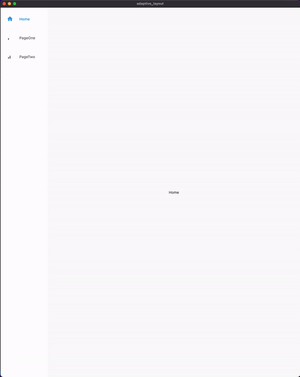

# adaptive_layout

Simple flutter example of routing different pages with an adaptive layout, allowing for development on multiple screen sizes, such as Desktop, Tablet, Mobile. 

If width of screen is >= 600, an adaptive side-bar NavigationRail will be displayed. 
If width of screen is < 600, a BottomNavigationBar will be displayed instead. 

Simplified from [this Flutter Codelabs example](https://github.com/flutter/codelabs/tree/main/boring_to_beautiful/final)

Easily add Navigation Items by creating a new NavigationDestination object in const List<NavigationDestination> destinations in router.dart. 

## Demo 
